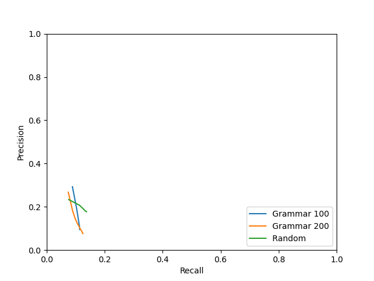

# Evaluation
## Grammar 100
### basic - keep

|  k | predicted extractions | gold extractions | matches | exact matches | prec | rec | F1 |
|-------------- | -------------- | -------------- | -------------- | -------------- | -------------- | -------------- | -------------- | 
| k1 | 2249 | 5265 | 156 | 4 | 0.0694 | 0.0061 | 0.0112 | 
| k2 | 4476 | 5265 | 430 | 6 | 0.0960 | 0.0167 | 0.0284 | 
| k3 | 6708 | 5265 | 717 | 11 | 0.1063 | 0.0302 | 0.0471 | 
| k4 | 8909 | 5265 | 968 | 17 | **0.1079** | 0.0426 | 0.0611 | 
| k5 | 11103 | 5265 | 1128 | 23 | 0.1006 | 0.0517 | 0.0683 | 
| k6 | 13294 | 5265 | 1276 | 31 | 0.0949 | 0.0605 | 0.0739 | 
| k7 | 15468 | 5265 | 1390 | 34 | 0.0887 | 0.0678 | 0.0769 | 
| k8 | 17623 | 5265 | 1473 | 39 | 0.0824 | 0.0742 | 0.0781 | 
| k9 | 19776 | 5265 | 1542 | 45 | 0.0767 | 0.0799 | **0.0783** | 
| k10 | 21922 | 5265 | 1604 | 48 | 0.0720 | **0.0849** | 0.0779 | 

### basic - verb

|  k | predicted extractions | gold extractions | matches | exact matches | prec | rec | F1 |
|-------------- | -------------- | -------------- | -------------- | -------------- | -------------- | -------------- | -------------- | 
| k1 | 2249 | 5265 | 156 | 4 | 0.0694 | 0.0061 | 0.0112 | 
| k2 | 4476 | 5265 | 430 | 6 | 0.0960 | 0.0167 | 0.0284 | 
| k3 | 6708 | 5265 | 717 | 11 | 0.1063 | 0.0302 | 0.0471 | 
| k4 | 8905 | 5265 | 969 | 17 | **0.1080** | 0.0427 | 0.0612 | 
| k5 | 11075 | 5265 | 1129 | 23 | 0.1009 | 0.0518 | 0.0684 | 
| k6 | 13223 | 5265 | 1277 | 31 | 0.0955 | 0.0605 | 0.0741 | 
| k7 | 15338 | 5265 | 1391 | 34 | 0.0895 | 0.0679 | 0.0772 | 
| k8 | 17404 | 5265 | 1474 | 39 | 0.0835 | 0.0742 | 0.0786 | 
| k9 | 19429 | 5265 | 1541 | 45 | 0.0781 | 0.0799 | **0.0790** | 
| k10 | 21443 | 5265 | 1600 | 48 | 0.0734 | **0.0848** | 0.0787 | 

### f1 - keep

|  k | predicted extractions | gold extractions | matches | exact matches | prec | rec | F1 |
|-------------- | -------------- | -------------- | -------------- | -------------- | -------------- | -------------- | -------------- | 
| k0 | 3207 | 5265 | 3207 | 364 | **0.9356** | **0.3302** | **0.4881** | 

### f1 - verb

|  k | predicted extractions | gold extractions | matches | exact matches | prec | rec | F1 |
|-------------- | -------------- | -------------- | -------------- | -------------- | -------------- | -------------- | -------------- | 
| k0 | 3207 | 5265 | 3155 | 363 | **0.9198** | **0.3247** | **0.4800** | 

### max - keep

|  k | predicted extractions | gold extractions | matches | exact matches | prec | rec | F1 |
|-------------- | -------------- | -------------- | -------------- | -------------- | -------------- | -------------- | -------------- | 
| k1 | 2249 | 5265 | 821 | 5 | **0.2645** | 0.0806 | 0.1236 | 
| k2 | 3847 | 5265 | 932 | 7 | 0.1791 | 0.0945 | **0.1237** | 
| k3 | 5064 | 5265 | 969 | 9 | 0.1425 | 0.0987 | 0.1167 | 
| k4 | 5968 | 5265 | 994 | 9 | 0.1243 | 0.1011 | 0.1115 | 
| k5 | 6688 | 5265 | 1009 | 9 | 0.1130 | 0.1026 | 0.1075 | 
| k6 | 7363 | 5265 | 1013 | 9 | 0.1032 | 0.1030 | 0.1031 | 
| k7 | 7881 | 5265 | 1025 | 9 | 0.0978 | 0.1042 | 0.1009 | 
| k8 | 8354 | 5265 | 1028 | 9 | 0.0926 | 0.1045 | 0.0982 | 
| k9 | 8799 | 5265 | 1028 | 9 | 0.0880 | 0.1046 | 0.0956 | 
| k10 | 9202 | 5265 | 1030 | 9 | 0.0842 | **0.1047** | 0.0934 | 

### max - verb

|  k | predicted extractions | gold extractions | matches | exact matches | prec | rec | F1 |
|-------------- | -------------- | -------------- | -------------- | -------------- | -------------- | -------------- | -------------- | 
| k1 | 2249 | 5265 | 824 | 5 | **0.2650** | 0.0805 | 0.1235 | 
| k2 | 3846 | 5265 | 934 | 14 | 0.1797 | 0.0942 | **0.1236** | 
| k3 | 5062 | 5265 | 970 | 19 | 0.1429 | 0.0985 | 0.1166 | 
| k4 | 5965 | 5265 | 995 | 21 | 0.1246 | 0.1009 | 0.1115 | 
| k5 | 6683 | 5265 | 1009 | 21 | 0.1132 | 0.1023 | 0.1075 | 
| k6 | 7357 | 5265 | 1014 | 22 | 0.1035 | 0.1028 | 0.1031 | 
| k7 | 7873 | 5265 | 1024 | 22 | 0.0980 | 0.1038 | 0.1008 | 
| k8 | 8344 | 5265 | 1027 | 22 | 0.0928 | 0.1041 | 0.0981 | 
| k9 | 8786 | 5265 | 1027 | 23 | 0.0882 | 0.1042 | 0.0956 | 
| k10 | 9188 | 5265 | 1029 | 24 | 0.0845 | **0.1044** | 0.0934 | 

### prec - keep

|  k | predicted extractions | gold extractions | matches | exact matches | prec | rec | F1 |
|-------------- | -------------- | -------------- | -------------- | -------------- | -------------- | -------------- | -------------- | 
| k0 | 3156 | 5265 | 3155 | 53 | **0.9499** | **0.1974** | **0.3269** | 

### prec - verb

|  k | predicted extractions | gold extractions | matches | exact matches | prec | rec | F1 |
|-------------- | -------------- | -------------- | -------------- | -------------- | -------------- | -------------- | -------------- | 
| k0 | 3155 | 5265 | 3103 | 53 | **0.9341** | **0.1951** | **0.3228** | 

### rec - keep

|  k | predicted extractions | gold extractions | matches | exact matches | prec | rec | F1 |
|-------------- | -------------- | -------------- | -------------- | -------------- | -------------- | -------------- | -------------- | 
| k0 | 3207 | 5265 | 3207 | 364 | **0.9350** | **0.3304** | **0.4883** | 

### rec - verb

|  k | predicted extractions | gold extractions | matches | exact matches | prec | rec | F1 |
|-------------- | -------------- | -------------- | -------------- | -------------- | -------------- | -------------- | -------------- | 
| k0 | 3207 | 5265 | 3157 | 363 | **0.9198** | **0.3251** | **0.4803** | 

## Grammar 200
### basic - keep

|  k | predicted extractions | gold extractions | matches | exact matches | prec | rec | F1 |
|-------------- | -------------- | -------------- | -------------- | -------------- | -------------- | -------------- | -------------- | 
| k1 | 2265 | 5265 | 141 | 2 | 0.0623 | 0.0054 | 0.0100 | 
| k2 | 4530 | 5265 | 416 | 5 | 0.0918 | 0.0162 | 0.0276 | 
| k3 | 6794 | 5265 | 732 | 11 | 0.1077 | 0.0297 | 0.0466 | 
| k4 | 9052 | 5265 | 1023 | 13 | **0.1130** | 0.0417 | 0.0610 | 
| k5 | 11306 | 5265 | 1222 | 19 | 0.1081 | 0.0517 | 0.0699 | 
| k6 | 13558 | 5265 | 1403 | 22 | 0.1035 | 0.0590 | 0.0751 | 
| k7 | 15803 | 5265 | 1513 | 28 | 0.0957 | 0.0656 | 0.0779 | 
| k8 | 18048 | 5265 | 1618 | 31 | 0.0896 | 0.0709 | **0.0792** | 
| k9 | 20292 | 5265 | 1687 | 35 | 0.0831 | 0.0745 | 0.0786 | 
| k10 | 22532 | 5265 | 1758 | 36 | 0.0780 | **0.0783** | 0.0781 | 

### basic - verb

|  k | predicted extractions | gold extractions | matches | exact matches | prec | rec | F1 |
|-------------- | -------------- | -------------- | -------------- | -------------- | -------------- | -------------- | -------------- | 
| k1 | 2265 | 5265 | 141 | 2 | 0.0623 | 0.0054 | 0.0100 | 
| k2 | 4530 | 5265 | 416 | 5 | 0.0918 | 0.0162 | 0.0276 | 
| k3 | 6794 | 5265 | 732 | 11 | 0.1077 | 0.0297 | 0.0466 | 
| k4 | 9050 | 5265 | 1023 | 13 | **0.1130** | 0.0417 | 0.0610 | 
| k5 | 11303 | 5265 | 1222 | 19 | 0.1081 | 0.0517 | 0.0699 | 
| k6 | 13553 | 5265 | 1403 | 22 | 0.1035 | 0.0590 | 0.0751 | 
| k7 | 15793 | 5265 | 1513 | 28 | 0.0958 | 0.0656 | 0.0779 | 
| k8 | 18028 | 5265 | 1618 | 31 | 0.0897 | 0.0709 | **0.0792** | 
| k9 | 20256 | 5265 | 1687 | 35 | 0.0833 | 0.0745 | 0.0786 | 
| k10 | 22478 | 5265 | 1757 | 36 | 0.0782 | **0.0783** | 0.0782 | 

### max - keep

|  k | predicted extractions | gold extractions | matches | exact matches | prec | rec | F1 |
|-------------- | -------------- | -------------- | -------------- | -------------- | -------------- | -------------- | -------------- | 
| k1 | 2265 | 5265 | 787 | 3 | **0.2494** | 0.0721 | **0.1119** | 
| k2 | 4090 | 5265 | 933 | 3 | 0.1642 | 0.0843 | 0.1114 | 
| k3 | 5763 | 5265 | 1029 | 3 | 0.1304 | 0.0922 | 0.1080 | 
| k4 | 7236 | 5265 | 1122 | 3 | 0.1133 | 0.0989 | 0.1056 | 
| k5 | 8577 | 5265 | 1169 | 3 | 0.1001 | 0.1035 | 0.1018 | 
| k6 | 9879 | 5265 | 1211 | 3 | 0.0905 | 0.1065 | 0.0979 | 
| k7 | 11085 | 5265 | 1262 | 3 | 0.0844 | 0.1106 | 0.0957 | 
| k8 | 12239 | 5265 | 1288 | 3 | 0.0782 | 0.1124 | 0.0922 | 
| k9 | 13355 | 5265 | 1310 | 3 | 0.0729 | 0.1138 | 0.0889 | 
| k10 | 14398 | 5265 | 1337 | 3 | 0.0692 | **0.1155** | 0.0865 | 

### max - verb

|  k | predicted extractions | gold extractions | matches | exact matches | prec | rec | F1 |
|-------------- | -------------- | -------------- | -------------- | -------------- | -------------- | -------------- | -------------- | 
| k1 | 2265 | 5265 | 879 | 5 | **0.2823** | 0.0821 | **0.1272** | 
| k2 | 4086 | 5265 | 1033 | 6 | 0.1843 | 0.0956 | 0.1259 | 
| k3 | 5754 | 5265 | 1123 | 6 | 0.1442 | 0.1033 | 0.1203 | 
| k4 | 7220 | 5265 | 1196 | 7 | 0.1229 | 0.1089 | 0.1155 | 
| k5 | 8556 | 5265 | 1238 | 7 | 0.1081 | 0.1126 | 0.1103 | 
| k6 | 9854 | 5265 | 1278 | 7 | 0.0974 | 0.1155 | 0.1057 | 
| k7 | 11057 | 5265 | 1319 | 7 | 0.0900 | 0.1185 | 0.1023 | 
| k8 | 12202 | 5265 | 1344 | 7 | 0.0833 | 0.1202 | 0.0984 | 
| k9 | 13314 | 5265 | 1366 | 7 | 0.0775 | 0.1216 | 0.0946 | 
| k10 | 14354 | 5265 | 1391 | 7 | 0.0733 | **0.1228** | 0.0918 | 

## Random

|  k | predicted extractions | gold extractions | matches | exact matches | prec | rec | F1 |
|-------------- | -------------- | -------------- | -------------- | -------------- | -------------- | -------------- | -------------- | 
| k1 | 2266 | 5265 | 728 | 13 | **0.2072** | 0.0656 | 0.0997 | 
| k2 | 3730 | 5265 | 1044 | 18 | 0.1846 | 0.0983 | 0.1283 | 
| k3 | 4521 | 5265 | 1153 | 23 | 0.1679 | 0.1101 | 0.1330 | 
| k4 | 4901 | 5265 | 1201 | 24 | 0.1608 | 0.1148 | 0.1340 | 
| k5 | 5044 | 5265 | 1223 | 25 | 0.1597 | 0.1171 | 0.1351 | 
| k6 | 5104 | 5265 | 1228 | 25 | 0.1588 | 0.1180 | **0.1354** | 
| k7 | 5130 | 5265 | 1231 | 25 | 0.1583 | 0.1182 | 0.1353 | 
| k8 | 5142 | 5265 | 1231 | 25 | 0.1579 | **0.1183** | 0.1353 | 
| k9 | 5143 | 5265 | 1231 | 25 | 0.1579 | **0.1183** | 0.1353 | 
| k10 | 5144 | 5265 | 1231 | 25 | 0.1579 | **0.1183** | 0.1353 | 

## P-R curve
