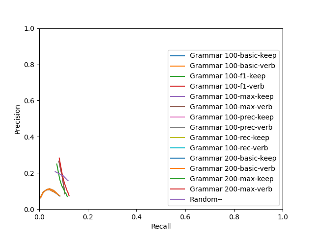

# Evaluation
## Grammar 100

|  k | predicted extractions | gold extractions | matches | exact matches | prec | rec | F1 |
|-------------- | -------------- | -------------- | -------------- | -------------- | -------------- | -------------- | -------------- | 
| k1 | 2249 | 5265 | 820 | 6 | **0.2654** | 0.0814 | **0.1245** | 
| k2 | 3823 | 5265 | 924 | 7 | 0.1781 | 0.0937 | 0.1228 | 
| k3 | 5022 | 5265 | 957 | 9 | 0.1419 | 0.0979 | 0.1159 | 
| k4 | 5899 | 5265 | 979 | 9 | 0.1236 | 0.1000 | 0.1106 | 
| k5 | 6588 | 5265 | 988 | 9 | 0.1123 | 0.1013 | 0.1065 | 
| k6 | 7229 | 5265 | 991 | 9 | 0.1028 | 0.1019 | 0.1024 | 
| k7 | 7721 | 5265 | 1003 | 9 | 0.0978 | 0.1029 | 0.1003 | 
| k8 | 8167 | 5265 | 1005 | 9 | 0.0928 | 0.1030 | 0.0976 | 
| k9 | 8577 | 5265 | 1007 | 9 | 0.0886 | 0.1034 | 0.0954 | 
| k10 | 8952 | 5265 | 1007 | 9 | 0.0849 | **0.1036** | 0.0933 | 

## Grammar 200

|  k | predicted extractions | gold extractions | matches | exact matches | prec | rec | F1 |
|-------------- | -------------- | -------------- | -------------- | -------------- | -------------- | -------------- | -------------- | 
| k1 | 2265 | 5265 | 767 | 3 | **0.2417** | 0.0690 | 0.1074 | 
| k2 | 4104 | 5265 | 929 | 3 | 0.1620 | 0.0827 | **0.1095** | 
| k3 | 5790 | 5265 | 1022 | 3 | 0.1286 | 0.0910 | 0.1066 | 
| k4 | 7274 | 5265 | 1104 | 3 | 0.1105 | 0.0971 | 0.1034 | 
| k5 | 8625 | 5265 | 1168 | 3 | 0.0990 | 0.1025 | 0.1007 | 
| k6 | 9941 | 5265 | 1209 | 3 | 0.0895 | 0.1056 | 0.0969 | 
| k7 | 11169 | 5265 | 1260 | 3 | 0.0831 | 0.1092 | 0.0944 | 
| k8 | 12353 | 5265 | 1293 | 3 | 0.0773 | 0.1114 | 0.0913 | 
| k9 | 13501 | 5265 | 1318 | 3 | 0.0724 | 0.1131 | 0.0882 | 
| k10 | 14575 | 5265 | 1346 | 3 | 0.0686 | **0.1151** | 0.0859 | 

## Random 

|  k | predicted extractions | gold extractions | matches | exact matches | prec | rec | F1 |
|-------------- | -------------- | -------------- | -------------- | -------------- | -------------- | -------------- | -------------- | 
| k1 | 2266 | 5265 | 728 | 13 | **0.2072** | 0.0656 | 0.0997 | 
| k2 | 3734 | 5265 | 1044 | 18 | 0.1844 | 0.0983 | 0.1282 | 
| k3 | 4536 | 5265 | 1153 | 23 | 0.1673 | 0.1101 | 0.1328 | 
| k4 | 4923 | 5265 | 1201 | 24 | 0.1601 | 0.1148 | 0.1337 | 
| k5 | 5068 | 5265 | 1223 | 25 | 0.1589 | 0.1170 | 0.1348 | 
| k6 | 5128 | 5265 | 1228 | 25 | 0.1581 | 0.1179 | **0.1351** | 
| k7 | 5154 | 5265 | 1231 | 25 | 0.1576 | 0.1181 | **0.1351** | 
| k8 | 5166 | 5265 | 1231 | 25 | 0.1572 | **0.1183** | 0.1350 | 
| k9 | 5167 | 5265 | 1231 | 25 | 0.1572 | **0.1183** | 0.1350 | 
| k10 | 5168 | 5265 | 1231 | 25 | 0.1572 | **0.1183** | 0.1350 | 

## P-R curve
