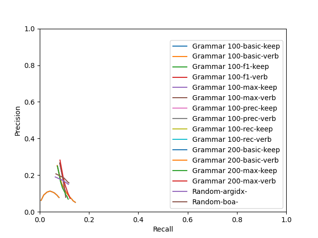

# Evaluation
## Grammar 100
### basic - keep

|  k | predicted extractions | gold extractions | matches | exact matches | prec | rec | F1 |
|-------------- | -------------- | -------------- | -------------- | -------------- | -------------- | -------------- | -------------- | 
| k1 | 2249 | 5265 | 725 | 49 | **0.2523** | 0.0708 | 0.1106 | 
| k2 | 4491 | 5265 | 877 | 64 | 0.1557 | 0.0881 | **0.1125** | 
| k3 | 6729 | 5265 | 992 | 79 | 0.1200 | 0.1018 | 0.1101 | 
| k4 | 8950 | 5265 | 1075 | 88 | 0.0987 | 0.1110 | 0.1045 | 
| k5 | 11167 | 5265 | 1146 | 101 | 0.0847 | 0.1193 | 0.0991 | 
| k6 | 13377 | 5265 | 1206 | 110 | 0.0748 | 0.1260 | 0.0939 | 
| k7 | 15579 | 5265 | 1251 | 112 | 0.0670 | 0.1315 | 0.0888 | 
| k8 | 17762 | 5265 | 1280 | 119 | 0.0602 | 0.1350 | 0.0833 | 
| k9 | 19937 | 5265 | 1321 | 125 | 0.0556 | 0.1402 | 0.0796 | 
| k10 | 22100 | 5265 | 1356 | 131 | 0.0517 | **0.1444** | 0.0762 | 

### f1 - keep

|  k | predicted extractions | gold extractions | matches | exact matches | prec | rec | F1 |
|-------------- | -------------- | -------------- | -------------- | -------------- | -------------- | -------------- | -------------- | 
| k0 | 3207 | 5265 | 3207 | 364 | **0.9356** | **0.3302** | **0.4881** | 

### max - keep

|  k | predicted extractions | gold extractions | matches | exact matches | prec | rec | F1 |
|-------------- | -------------- | -------------- | -------------- | -------------- | -------------- | -------------- | -------------- | 
| k1 | 2249 | 5265 | 826 | 4 | **0.2658** | 0.0809 | **0.1240** | 
| k2 | 3851 | 5265 | 936 | 9 | 0.1783 | 0.0941 | 0.1232 | 
| k3 | 5105 | 5265 | 970 | 9 | 0.1411 | 0.0987 | 0.1162 | 
| k4 | 6049 | 5265 | 987 | 9 | 0.1217 | 0.1010 | 0.1104 | 
| k5 | 6829 | 5265 | 1001 | 9 | 0.1096 | 0.1025 | 0.1059 | 
| k6 | 7564 | 5265 | 1009 | 9 | 0.0999 | 0.1033 | 0.1016 | 
| k7 | 8135 | 5265 | 1016 | 9 | 0.0936 | 0.1041 | 0.0986 | 
| k8 | 8688 | 5265 | 1019 | 9 | 0.0881 | 0.1046 | 0.0957 | 
| k9 | 9207 | 5265 | 1021 | 9 | 0.0833 | 0.1048 | 0.0928 | 
| k10 | 9675 | 5265 | 1024 | 9 | 0.0796 | **0.1052** | 0.0906 | 

### prec - keep

|  k | predicted extractions | gold extractions | matches | exact matches | prec | rec | F1 |
|-------------- | -------------- | -------------- | -------------- | -------------- | -------------- | -------------- | -------------- | 
| k0 | 3156 | 5265 | 3155 | 53 | **0.9499** | **0.1974** | **0.3269** | 

### rec - keep

|  k | predicted extractions | gold extractions | matches | exact matches | prec | rec | F1 |
|-------------- | -------------- | -------------- | -------------- | -------------- | -------------- | -------------- | -------------- | 
| k0 | 3207 | 5265 | 3207 | 364 | **0.9350** | **0.3304** | **0.4883** | 

## Grammar 200
### basic - keep

|  k | predicted extractions | gold extractions | matches | exact matches | prec | rec | F1 |
|-------------- | -------------- | -------------- | -------------- | -------------- | -------------- | -------------- | -------------- | 
| k1 | 2265 | 5265 | 688 | 59 | **0.2420** | 0.0651 | 0.1026 | 
| k2 | 4527 | 5265 | 889 | 74 | 0.1594 | 0.0825 | **0.1087** | 
| k3 | 6791 | 5265 | 1043 | 85 | 0.1258 | 0.0953 | 0.1084 | 
| k4 | 9050 | 5265 | 1135 | 93 | 0.1040 | 0.1031 | 0.1035 | 
| k5 | 11303 | 5265 | 1222 | 104 | 0.0901 | 0.1107 | 0.0993 | 
| k6 | 13559 | 5265 | 1286 | 109 | 0.0793 | 0.1157 | 0.0941 | 
| k7 | 15811 | 5265 | 1340 | 117 | 0.0712 | 0.1213 | 0.0898 | 
| k8 | 18064 | 5265 | 1389 | 122 | 0.0651 | 0.1254 | 0.0857 | 
| k9 | 20310 | 5265 | 1427 | 128 | 0.0599 | 0.1292 | 0.0818 | 
| k10 | 22559 | 5265 | 1471 | 133 | 0.0558 | **0.1328** | 0.0786 | 

### f1 - keep

|  k | predicted extractions | gold extractions | matches | exact matches | prec | rec | F1 |
|-------------- | -------------- | -------------- | -------------- | -------------- | -------------- | -------------- | -------------- | 
| k0 | 3629 | 5265 | 3629 | 391 | **0.9519** | **0.3254** | **0.4850** | 

### max - keep

|  k | predicted extractions | gold extractions | matches | exact matches | prec | rec | F1 |
|-------------- | -------------- | -------------- | -------------- | -------------- | -------------- | -------------- | -------------- | 
| k1 | 2265 | 5265 | 775 | 3 | **0.2428** | 0.0713 | 0.1102 | 
| k2 | 4093 | 5265 | 924 | 3 | 0.1627 | 0.0841 | **0.1109** | 
| k3 | 5796 | 5265 | 1032 | 3 | 0.1296 | 0.0941 | 0.1090 | 
| k4 | 7293 | 5265 | 1108 | 3 | 0.1109 | 0.0995 | 0.1049 | 
| k5 | 8683 | 5265 | 1157 | 3 | 0.0980 | 0.1039 | 0.1009 | 
| k6 | 10037 | 5265 | 1199 | 3 | 0.0886 | 0.1073 | 0.0970 | 
| k7 | 11279 | 5265 | 1250 | 3 | 0.0825 | 0.1119 | 0.0950 | 
| k8 | 12492 | 5265 | 1272 | 3 | 0.0761 | 0.1134 | 0.0911 | 
| k9 | 13673 | 5265 | 1291 | 3 | 0.0708 | 0.1147 | 0.0875 | 
| k10 | 14792 | 5265 | 1312 | 3 | 0.0666 | **0.1164** | 0.0847 | 

### prec - keep

|  k | predicted extractions | gold extractions | matches | exact matches | prec | rec | F1 |
|-------------- | -------------- | -------------- | -------------- | -------------- | -------------- | -------------- | -------------- | 
| k0 | 3626 | 5265 | 3626 | 343 | **0.9713** | **0.2992** | **0.4575** | 

### rec - keep

|  k | predicted extractions | gold extractions | matches | exact matches | prec | rec | F1 |
|-------------- | -------------- | -------------- | -------------- | -------------- | -------------- | -------------- | -------------- | 
| k0 | 3600 | 5265 | 3600 | 197 | **0.8854** | **0.3231** | **0.4734** | 

## Random
### argidx - 

|  k | predicted extractions | gold extractions | matches | exact matches | prec | rec | F1 |
|-------------- | -------------- | -------------- | -------------- | -------------- | -------------- | -------------- | -------------- | 
| k1 | 2266 | 5265 | 703 | 12 | **0.1903** | 0.0629 | 0.0946 | 
| k2 | 3732 | 5265 | 1021 | 16 | 0.1713 | 0.0938 | 0.1212 | 
| k3 | 4526 | 5265 | 1148 | 19 | 0.1590 | 0.1073 | 0.1281 | 
| k4 | 4910 | 5265 | 1200 | 20 | 0.1530 | 0.1127 | 0.1298 | 
| k5 | 5053 | 5265 | 1225 | 21 | 0.1519 | 0.1150 | 0.1309 | 
| k6 | 5113 | 5265 | 1232 | 21 | 0.1509 | 0.1158 | 0.1311 | 
| k7 | 5139 | 5265 | 1236 | 21 | 0.1506 | 0.1162 | **0.1312** | 
| k8 | 5151 | 5265 | 1236 | 21 | 0.1502 | **0.1163** | 0.1311 | 
| k9 | 5152 | 5265 | 1236 | 21 | 0.1501 | **0.1163** | 0.1311 | 
| k10 | 5153 | 5265 | 1236 | 21 | 0.1501 | **0.1163** | 0.1310 | 

### boa - 

|  k | predicted extractions | gold extractions | matches | exact matches | prec | rec | F1 |
|-------------- | -------------- | -------------- | -------------- | -------------- | -------------- | -------------- | -------------- | 
| k1 | 2266 | 5265 | 728 | 13 | **0.2072** | 0.0656 | 0.0997 | 
| k2 | 3730 | 5265 | 1044 | 18 | 0.1846 | 0.0983 | 0.1283 | 
| k3 | 4521 | 5265 | 1153 | 23 | 0.1679 | 0.1101 | 0.1330 | 
| k4 | 4901 | 5265 | 1201 | 24 | 0.1608 | 0.1148 | 0.1340 | 
| k5 | 5044 | 5265 | 1223 | 25 | 0.1597 | 0.1171 | 0.1351 | 
| k6 | 5104 | 5265 | 1228 | 25 | 0.1588 | 0.1180 | **0.1354** | 
| k7 | 5130 | 5265 | 1231 | 25 | 0.1583 | 0.1182 | 0.1353 | 
| k8 | 5142 | 5265 | 1231 | 25 | 0.1579 | **0.1183** | 0.1353 | 
| k9 | 5143 | 5265 | 1231 | 25 | 0.1579 | **0.1183** | 0.1353 | 
| k10 | 5144 | 5265 | 1231 | 25 | 0.1579 | **0.1183** | 0.1353 | 

## P-R curve
