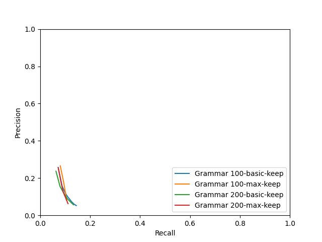

# Evaluation
## Grammar 100
### basic - keep

|  k | predicted extractions | gold extractions | matches | exact matches | prec | rec | F1 |
|-------------- | -------------- | -------------- | -------------- | -------------- | -------------- | -------------- | -------------- | 
| k1 | 2249 | 5265 | 738 | 46 | **0.2576** | 0.0718 | 0.1124 | 
| k2 | 4491 | 5265 | 884 | 62 | 0.1566 | 0.0878 | **0.1125** | 
| k3 | 6729 | 5265 | 990 | 74 | 0.1202 | 0.1002 | 0.1093 | 
| k4 | 8950 | 5265 | 1074 | 85 | 0.0993 | 0.1102 | 0.1045 | 
| k5 | 11167 | 5265 | 1146 | 96 | 0.0854 | 0.1186 | 0.0993 | 
| k6 | 13377 | 5265 | 1198 | 106 | 0.0749 | 0.1245 | 0.0936 | 
| k7 | 15579 | 5265 | 1249 | 112 | 0.0673 | 0.1303 | 0.0888 | 
| k8 | 17762 | 5265 | 1286 | 115 | 0.0609 | 0.1346 | 0.0838 | 
| k9 | 19938 | 5265 | 1328 | 124 | 0.0563 | 0.1401 | 0.0804 | 
| k10 | 22103 | 5265 | 1376 | 128 | 0.0526 | **0.1445** | 0.0772 | 

### f1 - keep

|  model | predicted extractions | gold extractions | matches | exact matches | prec | rec | F1 |
|-------------- | -------------- | -------------- | -------------- | -------------- | -------------- | -------------- | -------------- | 
| all | 3422 | 5265 | 3422 | 408 | **0.9472** | **0.3784** | **0.5408** | 

### max - keep

|  k | predicted extractions | gold extractions | matches | exact matches | prec | rec | F1 |
|-------------- | -------------- | -------------- | -------------- | -------------- | -------------- | -------------- | -------------- | 
| k1 | 2249 | 5265 | 830 | 4 | **0.2659** | 0.0802 | **0.1233** | 
| k2 | 3872 | 5265 | 951 | 8 | 0.1788 | 0.0936 | 0.1229 | 
| k3 | 5161 | 5265 | 983 | 10 | 0.1410 | 0.0986 | 0.1160 | 
| k4 | 6135 | 5265 | 1004 | 10 | 0.1221 | 0.1009 | 0.1105 | 
| k5 | 6940 | 5265 | 1016 | 10 | 0.1096 | 0.1025 | 0.1060 | 
| k6 | 7699 | 5265 | 1026 | 10 | 0.1000 | 0.1036 | 0.1018 | 
| k7 | 8290 | 5265 | 1035 | 10 | 0.0940 | 0.1046 | 0.0990 | 
| k8 | 8864 | 5265 | 1043 | 10 | 0.0885 | 0.1051 | 0.0961 | 
| k9 | 9397 | 5265 | 1046 | 10 | 0.0837 | 0.1056 | 0.0934 | 
| k10 | 9890 | 5265 | 1047 | 10 | 0.0797 | **0.1058** | 0.0909 | 

### prec - keep

|  model | predicted extractions | gold extractions | matches | exact matches | prec | rec | F1 |
|-------------- | -------------- | -------------- | -------------- | -------------- | -------------- | -------------- | -------------- | 
| all | 3415 | 5265 | 3415 | 378 | **0.9566** | **0.3519** | **0.5145** | 

### rec - keep

|  model | predicted extractions | gold extractions | matches | exact matches | prec | rec | F1 |
|-------------- | -------------- | -------------- | -------------- | -------------- | -------------- | -------------- | -------------- | 
| all | 3394 | 5265 | 3394 | 163 | **0.8708** | **0.3764** | **0.5256** | 

## Grammar 200
### basic - keep

|  k | predicted extractions | gold extractions | matches | exact matches | prec | rec | F1 |
|-------------- | -------------- | -------------- | -------------- | -------------- | -------------- | -------------- | -------------- | 
| k1 | 2265 | 5265 | 667 | 50 | **0.2371** | 0.0630 | 0.0995 | 
| k2 | 4529 | 5265 | 861 | 63 | 0.1553 | 0.0793 | 0.1050 | 
| k3 | 6792 | 5265 | 1007 | 81 | 0.1222 | 0.0930 | **0.1056** | 
| k4 | 9051 | 5265 | 1118 | 87 | 0.1031 | 0.1018 | 0.1024 | 
| k5 | 11304 | 5265 | 1198 | 99 | 0.0889 | 0.1089 | 0.0979 | 
| k6 | 13560 | 5265 | 1290 | 104 | 0.0797 | 0.1156 | 0.0944 | 
| k7 | 15812 | 5265 | 1351 | 113 | 0.0722 | 0.1213 | 0.0905 | 
| k8 | 18065 | 5265 | 1410 | 116 | 0.0662 | 0.1256 | 0.0867 | 
| k9 | 20316 | 5265 | 1463 | 123 | 0.0612 | 0.1299 | 0.0832 | 
| k10 | 22567 | 5265 | 1506 | 128 | 0.0569 | **0.1331** | 0.0798 | 

### f1 - keep

|  model | predicted extractions | gold extractions | matches | exact matches | prec | rec | F1 |
|-------------- | -------------- | -------------- | -------------- | -------------- | -------------- | -------------- | -------------- | 
| all | 3908 | 5265 | 3908 | 409 | **0.9524** | **0.3608** | **0.5234** | 

### max - keep

|  k | predicted extractions | gold extractions | matches | exact matches | prec | rec | F1 |
|-------------- | -------------- | -------------- | -------------- | -------------- | -------------- | -------------- | -------------- | 
| k1 | 2265 | 5265 | 798 | 5 | **0.2546** | 0.0721 | 0.1124 | 
| k2 | 4120 | 5265 | 951 | 5 | 0.1668 | 0.0849 | **0.1125** | 
| k3 | 5859 | 5265 | 1026 | 5 | 0.1279 | 0.0915 | 0.1067 | 
| k4 | 7412 | 5265 | 1093 | 7 | 0.1084 | 0.0971 | 0.1024 | 
| k5 | 8858 | 5265 | 1144 | 7 | 0.0955 | 0.1013 | 0.0983 | 
| k6 | 10258 | 5265 | 1175 | 8 | 0.0853 | 0.1042 | 0.0938 | 
| k7 | 11533 | 5265 | 1205 | 8 | 0.0782 | 0.1070 | 0.0903 | 
| k8 | 12771 | 5265 | 1224 | 8 | 0.0717 | 0.1084 | 0.0863 | 
| k9 | 13978 | 5265 | 1247 | 8 | 0.0667 | 0.1098 | 0.0830 | 
| k10 | 15130 | 5265 | 1273 | 8 | 0.0630 | **0.1115** | 0.0805 | 

### prec - keep

|  model | predicted extractions | gold extractions | matches | exact matches | prec | rec | F1 |
|-------------- | -------------- | -------------- | -------------- | -------------- | -------------- | -------------- | -------------- | 
| all | 3895 | 5265 | 3895 | 354 | **0.9565** | **0.3293** | **0.4899** | 

### rec - keep

|  model | predicted extractions | gold extractions | matches | exact matches | prec | rec | F1 |
|-------------- | -------------- | -------------- | -------------- | -------------- | -------------- | -------------- | -------------- | 
| all | 3888 | 5265 | 3888 | 195 | **0.8955** | **0.3598** | **0.5134** | 

## P-R curve
