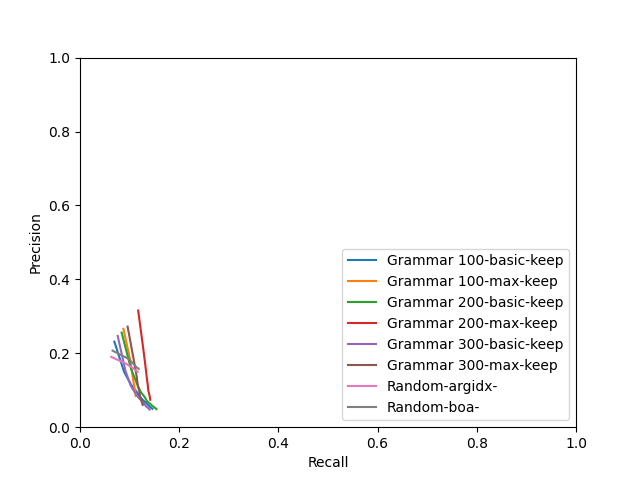

# Evaluation
## Grammar 100
### basic - keep

|  k | predicted extractions | gold extractions | matches | exact matches | prec | rec | F1 |
|-------------- | -------------- | -------------- | -------------- | -------------- | -------------- | -------------- | -------------- | 
| k1 | 2252 | 5265 | 679 | 52 | **0.2316** | 0.0692 | 0.1066 | 
| k2 | 4494 | 5265 | 850 | 69 | 0.1497 | 0.0889 | **0.1116** | 
| k3 | 6730 | 5265 | 960 | 80 | 0.1148 | 0.1031 | 0.1086 | 
| k4 | 8947 | 5265 | 1055 | 88 | 0.0961 | 0.1141 | 0.1043 | 
| k5 | 11161 | 5265 | 1120 | 96 | 0.0818 | 0.1215 | 0.0978 | 
| k6 | 13361 | 5265 | 1174 | 105 | 0.0720 | 0.1279 | 0.0922 | 
| k7 | 15551 | 5265 | 1220 | 111 | 0.0648 | 0.1339 | 0.0873 | 
| k8 | 17723 | 5265 | 1258 | 117 | 0.0588 | 0.1385 | 0.0826 | 
| k9 | 19888 | 5265 | 1290 | 123 | 0.0537 | 0.1422 | 0.0779 | 
| k10 | 22040 | 5265 | 1322 | 126 | 0.0498 | **0.1461** | 0.0743 | 

### f1 - keep

|  model | predicted extractions | gold extractions | matches | exact matches | prec | rec | F1 |
|-------------- | -------------- | -------------- | -------------- | -------------- | -------------- | -------------- | -------------- | 
| all | 3291 | 5265 | 3291 | 387 | **0.9320** | **0.3651** | **0.5247** | 

### max - keep

|  k | predicted extractions | gold extractions | matches | exact matches | prec | rec | F1 |
|-------------- | -------------- | -------------- | -------------- | -------------- | -------------- | -------------- | -------------- | 
| k1 | 2252 | 5265 | 877 | 6 | **0.2661** | 0.0875 | **0.1317** | 
| k2 | 3681 | 5265 | 980 | 6 | 0.1834 | 0.1010 | 0.1303 | 
| k3 | 4816 | 5265 | 1007 | 7 | 0.1454 | 0.1054 | 0.1222 | 
| k4 | 5676 | 5265 | 1025 | 7 | 0.1256 | 0.1073 | 0.1157 | 
| k5 | 6355 | 5265 | 1038 | 7 | 0.1138 | 0.1093 | 0.1115 | 
| k6 | 6985 | 5265 | 1042 | 7 | 0.1040 | 0.1099 | 0.1069 | 
| k7 | 7475 | 5265 | 1054 | 7 | 0.0983 | 0.1113 | 0.1044 | 
| k8 | 7946 | 5265 | 1058 | 7 | 0.0928 | 0.1117 | 0.1014 | 
| k9 | 8383 | 5265 | 1059 | 7 | 0.0882 | 0.1119 | 0.0986 | 
| k10 | 8774 | 5265 | 1060 | 7 | 0.0844 | **0.1122** | 0.0963 | 

### prec - keep

|  model | predicted extractions | gold extractions | matches | exact matches | prec | rec | F1 |
|-------------- | -------------- | -------------- | -------------- | -------------- | -------------- | -------------- | -------------- | 
| all | 3285 | 5265 | 3285 | 370 | **0.9440** | **0.3430** | **0.5032** | 

### rec - keep

|  model | predicted extractions | gold extractions | matches | exact matches | prec | rec | F1 |
|-------------- | -------------- | -------------- | -------------- | -------------- | -------------- | -------------- | -------------- | 
| all | 3267 | 5265 | 3267 | 188 | **0.8479** | **0.3633** | **0.5086** | 

## Grammar 200
### basic - keep

|  k | predicted extractions | gold extractions | matches | exact matches | prec | rec | F1 |
|-------------- | -------------- | -------------- | -------------- | -------------- | -------------- | -------------- | -------------- | 
| k1 | 2264 | 5265 | 745 | 75 | **0.2561** | 0.0839 | **0.1264** | 
| k2 | 4524 | 5265 | 903 | 92 | 0.1584 | 0.1027 | 0.1246 | 
| k3 | 6783 | 5265 | 1005 | 109 | 0.1191 | 0.1144 | 0.1167 | 
| k4 | 9037 | 5265 | 1069 | 121 | 0.0957 | 0.1222 | 0.1073 | 
| k5 | 11287 | 5265 | 1139 | 129 | 0.0821 | 0.1302 | 0.1007 | 
| k6 | 13538 | 5265 | 1172 | 130 | 0.0708 | 0.1349 | 0.0929 | 
| k7 | 15785 | 5265 | 1226 | 144 | 0.0638 | 0.1411 | 0.0879 | 
| k8 | 18030 | 5265 | 1263 | 153 | 0.0578 | 0.1457 | 0.0827 | 
| k9 | 20272 | 5265 | 1306 | 159 | 0.0532 | 0.1506 | 0.0787 | 
| k10 | 22513 | 5265 | 1332 | 160 | 0.0489 | **0.1542** | 0.0743 | 

### f1 - keep

|  model | predicted extractions | gold extractions | matches | exact matches | prec | rec | F1 |
|-------------- | -------------- | -------------- | -------------- | -------------- | -------------- | -------------- | -------------- | 
| all | 4007 | 5265 | 4006 | 623 | **0.9493** | **0.4465** | **0.6074** | 

### max - keep

|  k | predicted extractions | gold extractions | matches | exact matches | prec | rec | F1 |
|-------------- | -------------- | -------------- | -------------- | -------------- | -------------- | -------------- | -------------- | 
| k1 | 2264 | 5265 | 1072 | 3 | **0.3155** | 0.1173 | **0.1710** | 
| k2 | 3755 | 5265 | 1161 | 4 | 0.2089 | 0.1279 | 0.1587 | 
| k3 | 5133 | 5265 | 1198 | 4 | 0.1591 | 0.1325 | 0.1446 | 
| k4 | 6337 | 5265 | 1217 | 4 | 0.1313 | 0.1349 | 0.1331 | 
| k5 | 7402 | 5265 | 1233 | 4 | 0.1140 | 0.1367 | 0.1243 | 
| k6 | 8422 | 5265 | 1241 | 4 | 0.1008 | 0.1375 | 0.1163 | 
| k7 | 9337 | 5265 | 1255 | 4 | 0.0921 | 0.1390 | 0.1108 | 
| k8 | 10224 | 5265 | 1265 | 4 | 0.0851 | 0.1403 | 0.1059 | 
| k9 | 11079 | 5265 | 1275 | 4 | 0.0792 | 0.1411 | 0.1015 | 
| k10 | 11880 | 5265 | 1280 | 4 | 0.0742 | **0.1417** | 0.0974 | 

### prec - keep

|  model | predicted extractions | gold extractions | matches | exact matches | prec | rec | F1 |
|-------------- | -------------- | -------------- | -------------- | -------------- | -------------- | -------------- | -------------- | 
| all | 3996 | 5265 | 3995 | 557 | **0.9621** | **0.4112** | **0.5761** | 

### rec - keep

|  model | predicted extractions | gold extractions | matches | exact matches | prec | rec | F1 |
|-------------- | -------------- | -------------- | -------------- | -------------- | -------------- | -------------- | -------------- | 
| all | 3968 | 5265 | 3967 | 246 | **0.8529** | **0.4425** | **0.5827** | 

## Grammar 300
### basic - keep

|  k | predicted extractions | gold extractions | matches | exact matches | prec | rec | F1 |
|-------------- | -------------- | -------------- | -------------- | -------------- | -------------- | -------------- | -------------- | 
| k1 | 2266 | 5265 | 710 | 65 | **0.2470** | 0.0760 | **0.1163** | 
| k2 | 4529 | 5265 | 862 | 80 | 0.1518 | 0.0918 | 0.1144 | 
| k3 | 6793 | 5265 | 960 | 91 | 0.1131 | 0.1021 | 0.1073 | 
| k4 | 9052 | 5265 | 1052 | 98 | 0.0930 | 0.1110 | 0.1012 | 
| k5 | 11309 | 5265 | 1117 | 103 | 0.0797 | 0.1179 | 0.0951 | 
| k6 | 13566 | 5265 | 1174 | 110 | 0.0702 | 0.1253 | 0.0900 | 
| k7 | 15823 | 5265 | 1211 | 120 | 0.0626 | 0.1298 | 0.0845 | 
| k8 | 18080 | 5265 | 1244 | 129 | 0.0565 | 0.1331 | 0.0793 | 
| k9 | 20333 | 5265 | 1287 | 130 | 0.0520 | 0.1373 | 0.0754 | 
| k10 | 22588 | 5265 | 1313 | 134 | 0.0478 | **0.1403** | 0.0713 | 

### f1 - keep

|  model | predicted extractions | gold extractions | matches | exact matches | prec | rec | F1 |
|-------------- | -------------- | -------------- | -------------- | -------------- | -------------- | -------------- | -------------- | 
| all | 4407 | 5265 | 4406 | 574 | **0.9405** | **0.4534** | **0.6118** | 

### max - keep

|  k | predicted extractions | gold extractions | matches | exact matches | prec | rec | F1 |
|-------------- | -------------- | -------------- | -------------- | -------------- | -------------- | -------------- | -------------- | 
| k1 | 2266 | 5265 | 911 | 1 | **0.2720** | 0.0960 | **0.1419** | 
| k2 | 3966 | 5265 | 1044 | 1 | 0.1801 | 0.1087 | 0.1356 | 
| k3 | 5573 | 5265 | 1102 | 1 | 0.1365 | 0.1144 | 0.1245 | 
| k4 | 7043 | 5265 | 1134 | 1 | 0.1112 | 0.1167 | 0.1139 | 
| k5 | 8407 | 5265 | 1164 | 1 | 0.0960 | 0.1199 | 0.1066 | 
| k6 | 9720 | 5265 | 1174 | 2 | 0.0841 | 0.1209 | 0.0992 | 
| k7 | 10929 | 5265 | 1198 | 2 | 0.0766 | 0.1230 | 0.0944 | 
| k8 | 12117 | 5265 | 1213 | 2 | 0.0700 | 0.1242 | 0.0895 | 
| k9 | 13288 | 5265 | 1227 | 2 | 0.0649 | 0.1255 | 0.0856 | 
| k10 | 14413 | 5265 | 1238 | 2 | 0.0604 | **0.1265** | 0.0818 | 

### prec - keep

|  model | predicted extractions | gold extractions | matches | exact matches | prec | rec | F1 |
|-------------- | -------------- | -------------- | -------------- | -------------- | -------------- | -------------- | -------------- | 
| all | 4393 | 5265 | 4392 | 500 | **0.9483** | **0.4174** | **0.5797** | 

### rec - keep

|  model | predicted extractions | gold extractions | matches | exact matches | prec | rec | F1 |
|-------------- | -------------- | -------------- | -------------- | -------------- | -------------- | -------------- | -------------- | 
| all | 4381 | 5265 | 4380 | 226 | **0.8517** | **0.4503** | **0.5891** | 

## Random
### argidx - 

|  k | predicted extractions | gold extractions | matches | exact matches | prec | rec | F1 |
|-------------- | -------------- | -------------- | -------------- | -------------- | -------------- | -------------- | -------------- | 
| k1 | 2266 | 5265 | 703 | 12 | **0.1903** | 0.0629 | 0.0946 | 
| k2 | 3732 | 5265 | 1021 | 16 | 0.1713 | 0.0938 | 0.1212 | 
| k3 | 4526 | 5265 | 1148 | 19 | 0.1590 | 0.1073 | 0.1281 | 
| k4 | 4910 | 5265 | 1200 | 20 | 0.1530 | 0.1127 | 0.1298 | 
| k5 | 5053 | 5265 | 1225 | 21 | 0.1519 | 0.1150 | 0.1309 | 
| k6 | 5113 | 5265 | 1232 | 21 | 0.1509 | 0.1158 | 0.1311 | 
| k7 | 5139 | 5265 | 1236 | 21 | 0.1506 | 0.1162 | **0.1312** | 
| k8 | 5151 | 5265 | 1236 | 21 | 0.1502 | **0.1163** | 0.1311 | 
| k9 | 5152 | 5265 | 1236 | 21 | 0.1501 | **0.1163** | 0.1311 | 
| k10 | 5153 | 5265 | 1236 | 21 | 0.1501 | **0.1163** | 0.1310 | 

### boa - 

|  k | predicted extractions | gold extractions | matches | exact matches | prec | rec | F1 |
|-------------- | -------------- | -------------- | -------------- | -------------- | -------------- | -------------- | -------------- | 
| k1 | 2266 | 5265 | 728 | 13 | **0.2072** | 0.0656 | 0.0997 | 
| k2 | 3730 | 5265 | 1044 | 18 | 0.1846 | 0.0983 | 0.1283 | 
| k3 | 4521 | 5265 | 1153 | 23 | 0.1679 | 0.1101 | 0.1330 | 
| k4 | 4901 | 5265 | 1201 | 24 | 0.1608 | 0.1148 | 0.1340 | 
| k5 | 5044 | 5265 | 1223 | 25 | 0.1597 | 0.1171 | 0.1351 | 
| k6 | 5104 | 5265 | 1228 | 25 | 0.1588 | 0.1180 | **0.1354** | 
| k7 | 5130 | 5265 | 1231 | 25 | 0.1583 | 0.1182 | 0.1353 | 
| k8 | 5142 | 5265 | 1231 | 25 | 0.1579 | **0.1183** | 0.1353 | 
| k9 | 5143 | 5265 | 1231 | 25 | 0.1579 | **0.1183** | 0.1353 | 
| k10 | 5144 | 5265 | 1231 | 25 | 0.1579 | **0.1183** | 0.1353 | 

## P-R curve
