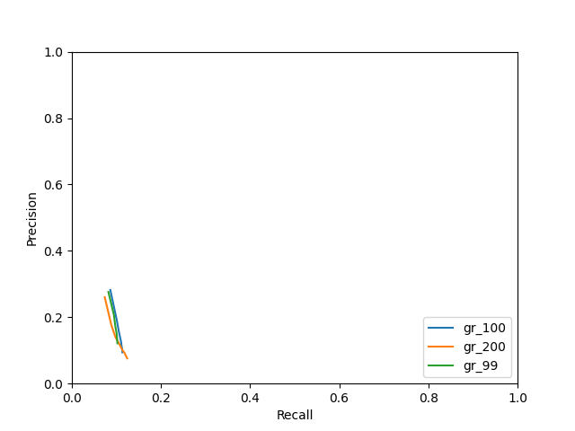

# Evaluation
## dev
### Grammar: 100

|  k | predicted extractions | gold extractions | matches | exact matches | prec | rec | F1 |
|-------------- | -------------- | -------------- | -------------- | -------------- | -------------- | -------------- | -------------- | 
| 1 | 2249 | 5269 | 894 | 31 | **0.2816** | 0.0334 | 0.0596 | 
| 2 | 3820 | 5269 | 1017 | 58 | 0.1921 | 0.0390 | **0.0649** | 
| 3 | 5012 | 5269 | 1063 | 67 | 0.1543 | 0.0406 | 0.0642 | 
| 4 | 5882 | 5269 | 1098 | 74 | 0.1361 | 0.0417 | 0.0639 | 
| 5 | 6564 | 5269 | 1115 | 83 | 0.1241 | 0.0425 | 0.0633 | 
| 6 | 7198 | 5269 | 1123 | 88 | 0.1140 | 0.0429 | 0.0624 | 
| 7 | 7689 | 5269 | 1129 | 97 | 0.1077 | 0.0434 | 0.0619 | 
| 8 | 8135 | 5269 | 1134 | 101 | 0.1025 | 0.0436 | 0.0612 | 
| 9 | 8539 | 5269 | 1136 | 104 | 0.0979 | **0.0437** | 0.0604 | 
| 10 | 8911 | 5269 | 1138 | 106 | 0.0939 | **0.0437** | 0.0596 | 

### Grammar: 200

|  k | predicted extractions | gold extractions | matches | exact matches | prec | rec | F1 |
|-------------- | -------------- | -------------- | -------------- | -------------- | -------------- | -------------- | -------------- | 
| 1 | 2265 | 5269 | 816 | 28 | **0.2602** | 0.0295 | 0.0529 | 
| 2 | 4086 | 5269 | 987 | 38 | 0.1758 | 0.0350 | 0.0583 | 
| 3 | 5766 | 5269 | 1091 | 50 | 0.1395 | 0.0384 | 0.0603 | 
| 4 | 7244 | 5269 | 1200 | 58 | 0.1221 | 0.0415 | 0.0619 | 
| 5 | 8590 | 5269 | 1270 | 65 | 0.1094 | 0.0432 | 0.0620 | 
| 6 | 9899 | 5269 | 1321 | 73 | 0.0991 | 0.0450 | 0.0619 | 
| 7 | 11110 | 5269 | 1375 | 82 | 0.0922 | 0.0469 | **0.0621** | 
| 8 | 12273 | 5269 | 1402 | 88 | 0.0854 | 0.0475 | 0.0611 | 
| 9 | 13403 | 5269 | 1434 | 96 | 0.0802 | 0.0484 | 0.0603 | 
| 10 | 14459 | 5269 | 1460 | 102 | 0.0759 | **0.0489** | 0.0595 | 

## P-R curve
